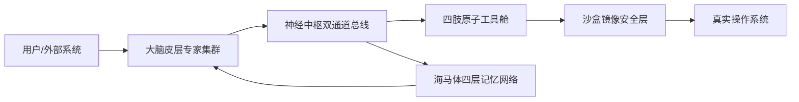

# Toti (饕餮) Python 试验机设计书 v1.0-final

**架构保真 · 工程落地双目标版本**

> 本设计书严格对齐 .NET 正式版 v1.0 的核心架构契约，全面适配 Python 3.12+ 异步生态。所有接口、协议、数据格式与正式版 100% 兼容，验证成果可无缝迁移至生产实现。

---

## 1. 项目概述与设计原则

### 1.1 核心定位
Toti Python 版是面向架构验证与快速迭代的**官方试验机**，完整复现「去中心化专家集群 + 多层级记忆网络 + 沙盒安全隔离 + 自我进化闭环」的数字生命体架构，发挥 Python 动态语言与 AI 生态优势缩短原型验证周期。

### 1.2 双目标设计原则
**架构保真（刚性约束）**

- 核心概念、模块职责、通信协议、数据契约与 .NET 正式版完全对齐。
- 协程槽、瀑布流记忆、三级决策链路、宪法约束、操作重放完整保留。
- 工具 manifest、TOON 语法、信封格式、记忆包结构完全兼容。

**工程落地（务实优化）**

- 优先选用 Python 生态成熟开源库（FastAPI、Lark、ChromaDB、NetworkX）。
- 针对 Python 语言特性做实现层妥协（用户态沙盒替代内核级 CoW），保留完整流程逻辑。
- 提供明确的目录结构、依赖清单、开发排期与部署方案。

### 1.3 与 .NET 正式版的差异说明

| 维度 | .NET 正式版 | Python 试验机 |
| :--- | :--- | :--- |
| 沙盒实现 | 操作系统级写时复制 | 用户态双模式：物理影子目录 + 内存虚拟 FS |
| 并发模型 | `System.Threading.Channel` | `asyncio.PriorityQueue` + `TaskGroup` |
| 代码热加载 | Roslyn 编译 csx | `importlib.reload()` 动态重载 |
| 部署形态 | Windows 原生服务 | 源码运行 / PyInstaller 打包 / 服务托管 |

---

## 2. 系统架构总览

| 核心要素 | 功能定位 | Python 技术承载 | 契约兼容性 |
| :--- | :--- | :--- | :--- |
| **神经中枢** | 双通道消息路由与任务编排 | `asyncio` + `PriorityQueue` + 协程槽状态机 | 100% |
| **海马体** | 四层记忆存储与语义检索 | `cachetools`(L1) + `aiosqlite`(L2) + `NetworkX`(L3) + `ChromaDB`(L4) | 100% |
| **大脑皮层** | 环境感知与分级自主决策 | 异步后台专家循环 + Ollama/OpenAI 异步客户端 | 100% |
| **四肢** | 原子化操作执行器 | 动态导入模块 + `pydantic` 校验 + 热重载 | 100% |
| **血液系统** | 统一数据模型与双态协议 | `Lark`(TOON) + `cbor2`(CBOR) + `pydantic`(Signal) | 100% |
| **沙盒** | 不可逆操作预演与安全校验 | 影子目录 + `pyfakefs` + OpLog 重放 | 逻辑对齐 |



**刚性架构规则**：所有模块间通信必须经过神经中枢统一路由，禁止专家之间、工具之间直接调用。

---

## 3. 神经中枢（双通道异步消息总线）

### 3.1 核心职责
- 维护**命令通道**（下行，P0~P3 优先级）和**回收通道**（上行）两条独立异步队列。
- 实现 `TotiEnvelope` 精准路由（点对点、广播、上报）。
- 管理任务生命周期：子任务串/并行编排、状态跟踪、结果自动聚合。

### 3.2 技术实现
- **底层队列**：`asyncio.PriorityQueue`，以 `(priority, envelope)` 元组排序。
- **消息模型**：`pydantic.BaseModel` 定义 `TotiEnvelope`，字段与正式版完全一致：
  - `id`、`correlation_id`、`sender`、`recipient`（`*` 为广播）、`payload`（CBOR 二进制）、`priority`（0~3）。
- **调度循环**：独立异步任务持续消费命令通道，按 `recipient` 路由。

### 3.3 关键机制
**协程槽（CorrelationSlot）**

- 以 `correlation_id` 为键维护全局字典，记录子任务列表、状态（Pending/Running/Aggregating/Finalized）、聚合结果与完成事件。
- 基于 `asyncio.TaskGroup` 实现串/并行编排。TOON 计划（`A > B | C`）解析为 DAG，串行链（`>`）等待前序事件信号，并行分支（`|`）使用 `gather` 并发触发。
- 所有子任务完成后自动触发聚合回调，合成最终信封提交至回收通道。

**背压控制**

- 回收通道 `maxsize=1000`，超限时命令通道写入端自动阻塞。
- 暴露水位监控指标。

**适配器边界**

中枢仅与适配器层交互（CLI、WebSocket、皮层专家、四肢执行器、记忆服务），不直接调用系统底层 API。

---

## 4. 海马体（四层记忆网络）

### 4.1 层级结构

| 层级 | 名称 | 存储介质 | Python 技术选型 | 用途 |
| :--- | :--- | :--- | :--- | :--- |
| **L1** | 工作闪电层 | 内存缓存 | `cachetools.TTLCache`（TTL 60s） | 当前会话上下文、瞬时任务栈 |
| **L2** | 叙事总结层 | 关系型数据库 | `aiosqlite` | 事件摘要、用户意图、重要性评分 |
| **L3** | 关系编织层 | 内存图 + 持久化 | `NetworkX.MultiDiGraph` + JSON 落盘 | 实体节点、关系边（触发/修改/相似） |
| **L4** | 肌肉印记层 | 向量数据库 | ChromaDB 原生客户端 | 工具调用参数与结果的向量索引 |

### 4.2 协同协议
**写入瀑布流**

任务完成后同步写入 L1；后台异步任务按顺序执行：L2 叙事总结（LLM 生成摘要 + 重要性评分）→ L3 实体关系抽取 → L4 向量化入库。不阻塞主链路。

**读取并行召回**

`asyncio.gather` 并行访问 L1 缓存、L2 关键词检索、L4 语义检索，结果经 L3 关系图谱补全（图传导推理：如 FileA 修改 LogFile，LogFile 属于 ProjectX，则补全 FileA 与 ProjectX 关联）后合并为 `MemoryBundle` 返回。

**分层遗忘机制**

- L1：`TTLCache` 自动过期。
- L2：每日定时任务执行权重衰减，删除重要性低于阈值的历史摘要。
- L3：每 24 小时剪枝孤立节点（`networkx.algorithms.isolates`，`degree=0` 且最后访问超过 7 天）。
- L4：写入新向量时计算与同 namespace 下现存向量的余弦相似度，> 0.95 不新增，原向量权重按 `w = min(1.0, w + 0.1)` 增强；每日执行 `weight *= exp(-decay_factor * days_since_access)`，`weight < 0.01` 时物理删除。

### 4.3 核心服务
- **记忆专家（皮层组件）**：负责 L2 摘要生成、L3 关系抽取、L4 向量更新与宪法规则推送。
- **统一查询接口**：`RecallService.recall(query: str, top_k: int) -> MemoryBundle`，签名与正式版一致。

---

## 5. 大脑皮层（去中心化专家集群）

### 5.1 专家体系
所有专家继承 `BaseCortexExpert` 抽象基类，以独立异步后台任务运行，所有通信通过神经中枢完成，禁止直接方法调用。

**领域感知专家**

各自负责特定领域的环境监控与分级决策，内置三级处理链路：

- **Tier0（静默反射）**：硬编码规则，零 LLM 调用，响应 <50ms。
- **Tier1（本地干预）**：通过 Ollama 调用本地小模型（Phi-3/Qwen2.5-3B）。
- **Tier2（上报协同）**：复杂问题封装为 `Escalation` 信封提交至统筹专家。

覆盖领域：
- `SystemCortex`：系统监控（`psutil` 采集 CPU/内存/磁盘）
- `FileCortex`：文件监控（`watchdog` 异步适配）
- `VisionCortex`：视觉感知（`mss` + OCR）
- `HardwareCortex`：硬件交互（`pyserial` / `bleak`）

**支撑专家（完整四件套）**

1. **统筹专家（Orchestrator）**：监听上报事件，调用大模型（OpenAI 兼容协议）拆解任务，生成 TOON 执行计划并派发子任务。
2. **记忆专家（Memory Archivist）**：封装海马体查询服务，管理写入瀑布流。
3. **自我认知专家（Self-Awareness）**：周期性统计系统指标（通道积压、工具成功率、专家响应时长、错误率），生成反思报告，触发进化信号。
4. **自我进化专家（Self-Evolution）**：接收进化请求，生成 Python 工具代码与 manifest，写入工具目录触发热加载。

### 5.2 协作模式
所有通信统一经由神经中枢路由：

- **点对点**：指定 `recipient` 精准投递。
- **全局广播**：`recipient = "*"`，转发至所有注册专家。
- **分级上报**：领域专家仅将 Tier2 问题升级至统筹专家。

### 5.3 宪法约束
- 宪法规则初始存储于配置文件，启动后加载至 L4 向量库（`namespace="constitution"`），运行时以 L4 版本为准。
- 所有专家执行高危操作前调用 `Constitution.check(operation)` 强制校验。
- 宪法修订需经审批流程，更新后由记忆专家向全集群广播生效。

---

## 6. 四肢（原子工具舱）

### 6.1 工具定义（契约 100% 兼容）
每个工具为独立文件夹：

- `manifest.json`：严格遵循统一 JSON Schema，定义名称、参数 Schema、权限声明、调用示例。
- `main.py`：必须包含异步入口：
  ```python
  async def execute(args: dict, context: ToolContext) -> dict:
      # 仅通过 context 安全 API 访问资源
  ```

### 6.2 执行环境与安全约束
- 工具仅能通过 `ToolContext` 提供的安全 API 访问沙盒文件系统，禁止直接使用原生 `os`/`shutil`/`open`。
- 入参根据 JSON Schema 自动校验（`pydantic` 运行时），权限由 `PermissionManager` 检查。
- 所有工具强制异步实现。

### 6.3 生命周期与热更新
- **启动加载**：扫描 `tools/`，通过 `importlib.util.spec_from_file_location` 动态导入。
- **热更新**：`watchdog` 监控文件变动，调用 `importlib.reload()` 原子替换，毫秒级生效。
- **调用流程**：中枢派发 → `ToolExecutor` 参数校验 → 权限检查 → 沙盒上下文执行 → 返回 `ToolResult`（CBOR 序列化）。

---

## 7. 血液系统（TOON/CBOR 双态协议）

### 7.1 统一信号模型（TotiSignal）
`pydantic` 定义严格 AST 模型，结构与正式版完全对齐：

```python
class TotiSignal(BaseModel):
    intent: str                     # "query", "command", "escalation"
    operation: str                  # "file.read", "process.kill"
    path: list[str] | None          # TOON 路径引用
    payload: Any                    # 具体载荷
    bindings: dict[str, Any]        # 变量引用绑定 ($var)
    metadata: dict = Field(default_factory=dict)
    signal_version: Literal["1.0.0"] = "1.0.0"
```

### 7.2 TOON（对外动脉）
- **语法规范**：与正式版 EBNF 文法完全一致，支持管道（`|`）、链式（`>`）、变量引用（`$`）。
- **解析实现**：基于 `Lark` 直接转录 EBNF 文法，避免方言化。
- **适用场景**：用户输入、LLM 上下文交互、专家间协商。

### 7.3 CBOR（对内静脉）
- **编码**：使用 `cbor2` 库，配合 `pydantic` 的 `model_dump` / `model_validate` 实现零样板转换。
- **适用场景**：模块间 IPC、海马体 BLOB 存储、沙盒 OpLog 流式写入。

### 7.4 转换枢纽（TranslationHub）
- `inbound(toon_text: str) -> TotiEnvelope`：TOON → `TotiSignal` → CBOR 信封。
- `outbound(signal: TotiSignal, result: dict) -> str`：CBOR 结果 → `TotiSignal` → TOON 文本。
- `internalize / externalize`：CBOR 二进制与 `TotiSignal` 双向互转。

---

## 8. 沙盒（镜像安全层）

### 8.1 设计理念
逻辑流程 100% 对齐正式版（预演-验证-审批-重放），实现层针对 Python 做务实优化。

### 8.2 双模式实现

**模式 A：物理影子目录（适配批量文件操作）**

- 在 `%TEMP%/toti_sandbox/{uuid}/` 使用 `shutil.copytree` 创建完整影子副本（针对目标目录）。
- 工具操作指向影子目录，通过 `filecmp.dircmp` 递归对比影子与真实目录，生成 `added`、`deleted`、`modified` 差异清单。
- 优势：兼容大文件；缺点：大目录拷贝有初始化开销。

**模式 B：内存虚拟文件系统（适配纯逻辑验证）**

- 基于 `pyfakefs` 挂载内存虚拟 FS，所有操作在内存中完成。
- 优势：速度极快，完全隔离；缺点：大文件内存占用高。

### 8.3 验证与重放机制
- **OpLog 操作日志**：所有影子操作以 CBOR 格式流式追加至 `.olog`，记录 `op_id`、`timestamp`、`full_path`、`old_hash`、`new_hash`。
- **差分验证器**：预演结束后对比初末状态，生成风险报告（新增/修改/删除文件数、注册表变更等）。
- **审批机制**：风险报告推送至用户（CLI/WebSocket），高危操作必须人工确认。
- **确定性重放**：审批通过后按 OpLog 顺序逐条重放至真实系统，失败立即中断，真实环境不受影响。

---

## 9. 数据流与交互时序

### 9.1 用户指令完整处理流程
1. CLI/WebSocket 发送 TOON 文本 → `TranslationHub.inbound()` 解析为 `TotiSignal` → 封装为 `TotiEnvelope` 送入命令通道。
2. 中枢消费循环根据 `recipient` 派发给对应领域专家或统筹专家。
3. 领域专家按 Tier0/Tier1/Tier2 处理；超出能力生成 `Escalation` 上报至统筹专家。
4. 统筹专家调用 LLM 生成 TOON 执行计划，拆解为多个子任务信封，重新注入命令通道。
5. 协程槽按 `correlation_id` 管理 DAG 编排，派发工具执行，结果写入回收通道。
6. 聚合器拼装所有子任务结果，交还统筹专家生成最终总结。
7. 经 `TranslationHub.outbound()` 转为 TOON 返回用户。
8. 全过程异步触发海马体瀑布流写入（L1 → L2 → L3 → L4）。

### 9.2 主动进化闭环
1. 自我认知专家周期性生成反思报告（统计指标：工具失败率、L2 摘要重复率、L4 命中率、队列积压深度），调用 LLM 输出优化建议，若健康度低于阈值，生成 `EvolutionSignal` 广播至自我进化专家。
2. 自我进化专家调用 LLM 生成工具代码与 `manifest.json`，写入 `tools/` 目录。
3. `watchdog` 触发热重载，新工具即时生效。
4. 记忆专家记录新工具信息至 L4。

---

## 10. 配置与启动

### 10.1 配置层级
- `pyproject.toml`：项目元数据与依赖管理。
- `config/settings.yaml`：基础运行配置（LLM 端点、监听端口、日志级别）。
- `config/ritual.yaml`：核心配置（专家注册列表、宪法路径、沙盒目录）。
- `config/omen.yaml`：阈值配置（Tier0/Tier1 触发阈值）。
- `.env` 环境变量：优先级最高，由 `python-dotenv` 加载。

统一由 `pydantic-settings` 加载，类型安全校验。

### 10.2 标准启动流程
1. 加载配置，初始化 `loguru` 结构化日志。
2. 启动 FastAPI 应用（uvicorn），提供 WebSocket 接入与 `/health` 端点。
3. 初始化海马体各层（L1 缓存、L2 SQLite 建表、L3 NetworkX 图加载、L4 ChromaDB 客户端）。
4. 扫描 `tools/` 目录，动态加载所有原子工具。
5. 实例化所有皮层专家，启动为后台异步任务并注册至中枢路由表。
6. 启动神经中枢双通道消费循环。
7. 启动 CLI 交互适配器（`prompt_toolkit` 异步封装）。
8. 主事件循环保持运行。

### 10.3 健康检查与看门狗
- `/health` 端点返回系统状态、通道积压数、在线专家数、工具数量。
- 内部心跳任务每 30 秒检测队列积压、CPU/内存占用，异常时触发告警或退出码触发外部进程管理器重启。

---

## 11. 工程落地补充

### 11.1 推荐项目目录结构
```
toti-python/
├── pyproject.toml
├── main.py
├── config/
│   ├── settings.yaml
│   ├── ritual.yaml
│   └── constitution.yaml
├── toti/
│   ├── hub/                    # 神经中枢
│   │   ├── message_bus.py
│   │   ├── correlation_slot.py
│   │   └── envelope.py
│   ├── hippocampus/            # 海马体
│   │   ├── l1_cache.py
│   │   ├── l2_sqlite.py
│   │   ├── l3_graph.py
│   │   ├── l4_vector.py
│   │   └── recall_service.py
│   ├── cortex/                 # 大脑皮层
│   │   ├── base.py
│   │   ├── orchestrator.py
│   │   ├── self_awareness.py
│   │   ├── self_evolution.py
│   │   └── system_cortex.py
│   ├── limbs/                  # 四肢
│   │   ├── executor.py
│   │   └── loader.py
│   ├── protocol/               # 血液系统
│   │   ├── signal.py
│   │   ├── toon_ebnf.lark
│   │   └── translation_hub.py
│   ├── sandbox/                # 沙盒
│   │   ├── shadow_fs.py
│   │   └── diff_validator.py
│   └── common/                 # 通用
│       ├── constitution.py
│       └── tool_context.py
├── tools/                      # 原子工具
├── data/                       # 持久化数据
│   ├── sqlite/
│   ├── chroma/
│   └── sandbox/
└── logs/
```

### 11.2 核心依赖清单
| 类别 | 依赖库 | 用途 |
| :--- | :--- | :--- |
| 异步框架 | `asyncio`（标准库） | 核心并发 |
| Web 服务 | `fastapi` + `uvicorn` | HTTP/WebSocket 适配器 |
| 数据模型 | `pydantic` + `pydantic-settings` | 类型安全与配置 |
| 序列化 | `cbor2` | CBOR 协议 |
| 语法解析 | `lark` | TOON 文法解析 |
| 缓存 | `cachetools` | L1 记忆层 |
| 数据库 | `aiosqlite` + `chromadb` | L2/L4 存储 |
| 图计算 | `networkx` | L3 关系图谱 |
| 文件监控 | `watchdog` | 工具热重载 |
| 系统交互 | `psutil` + `pywin32` | 系统监控与 Windows API |
| 沙盒 | `pyfakefs` | 内存虚拟文件系统 |
| 日志 | `loguru` | 结构化日志 |
| LLM | `openai` + `ollama` | 大模型与本地模型 |

---

## 12. 扩展开发指南

### 12.1 添加新原子工具
1. 在 `tools/` 下创建独立文件夹（名称即工具唯一标识）。
2. 编写 `manifest.json`（严格遵循统一 Schema）。
3. 编写 `main.py`，实现 `async def execute(args: dict, context: ToolContext) -> dict`，仅使用 `ToolContext` 安全 API。
4. 保存后系统自动热加载。

### 12.2 添加新皮层专家
1. 继承 `toti.cortex.base.BaseCortexExpert`。
2. 实现 `load_config()` 与 `async def sense()`。
3. 在启动流程中注册至中枢路由表，自动订阅命令通道消息。

### 12.3 扩展记忆存储
实现 `toti.hippocampus.base.MemoryStorage` 抽象接口，在依赖注入中替换对应层级实现。

---

## 13. 部署与运维
- **运行环境**：Python 3.12+，推荐 `uv` 管理虚拟环境。
- **操作系统**：Windows 10/11 为主，兼容 Linux/WSL（硬件功能受限）。
- **服务化**：winsw 或 NSSM 托管为 Windows 服务。
- **打包分发**：PyInstaller 或 Nuitka 打包为单 EXE。
- **日志**：`loguru` 输出至 `logs/`，按日期分割，支持 JSON 结构化格式。
- **监控**：可选集成 `prometheus-fastapi-instrumentator`，暴露 `/metrics`。

---

## 14. 安全与权限
- **能力令牌**：每次工具调用匹配 manifest 权限声明，越权直接拒绝。
- **路径白名单**：宪法定义 `allowed_paths`，沙盒层通过绝对路径前缀校验。
- **UAC 提权**：需管理员权限的操作，通过 `ShellExecuteW` 的 `runas` 动词启动独立子进程。
- **审计日志**：文件修改、进程启动、网络请求等敏感操作记录结构化审计日志。

---

## 15. 版本与演进
- **信号版本**：`TotiSignal.metadata["signal_version"] = "1.0.0-python"`，主版本号与正式版对齐。
- **工具版本**：`manifest.json` 的 `version` 字段支持灰度加载与版本回退。
- **宪法修订**：更新需经审批流程，记忆专家广播至全集群。
- **迁移承诺**：核心契约与正式版 100% 兼容，验证成果可无缝迁移至 .NET 生产实现。

---

## 16. MVP 开发路线图

| 里程碑 | 核心交付物 | 预估工期 | 验证目标 |
| :--- | :--- | :--- | :--- |
| **M1：核心骨架** | 双通道消息总线 + `TotiEnvelope` + TranslationHub 基础解析 + CLI/WebSocket 适配器 | 3 天 | 跑通「输入-路由-回显」基础链路 |
| **M2：工具系统** | 工具动态加载 + 热重载 + ToolContext + 基础沙盒双模式 | 3 天 | 验证工具热插拔与沙盒预演逻辑 |
| **M3：记忆雏形** | L1~L4 四层记忆实现 + 瀑布流写入 + 并行召回接口 | 2 天 | 验证多层记忆协同机制 |
| **M4：专家联动** | 领域专家基类 + SystemCortex(Tier0) + 统筹专家 + LLM 任务拆解 | 4 天 | 验证分级决策与任务编排能力 |
| **M5：安全闭环** | 差分验证器 + OpLog 重放 + 人工审批流程 + 宪法约束 | 2 天 | 跑通「预演-审批-执行」安全闭环 |
| **M6：自我进化** | 自我认知专家 + 自我进化专家 + 代码生成热加载 | 3 天 | 验证主动进化完整闭环 |

> 总工期约 17 天。

---

**© 2026 Toti 项目组**